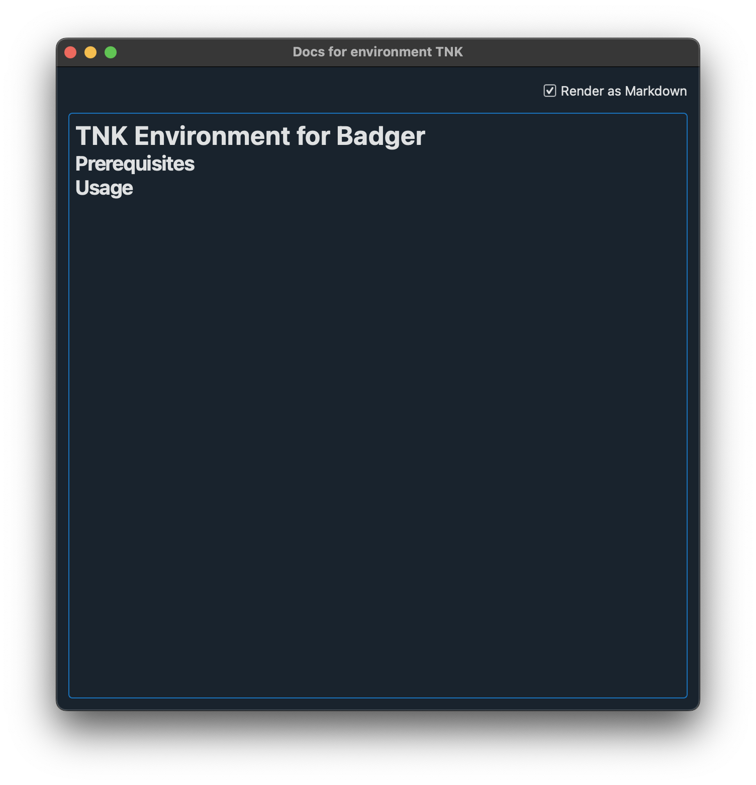

# Main Interface Layout

- **File**: `src/badger/gui/pages/home_page.py`
- **Screenshot**: 
- **Description**: Main Badger GUI window. Conains the sub-objects below.

## Status Bar
- **File**: `src/badger/gui/components/status_bar.py`
- **Screenshot**: 
- **Description**: Bottom status bar displaying optimization summary with eliding text label and settings button (gear icon) that launches the BadgerSettingsDialog.

## History Navigator

- **File**: `src/badger/gui/components/history_navigator.py`
- **Screenshot**: 
- **Description**: Tree-based browser for archived optimization runs with date-based organization, inherits from default history navigator with bold header styling.

## Routine Configuration

### Routine Editor
- **File**: `src/badger/gui/components/routine_page.py`
- **Screenshot**: 
- **Description**: Comprehensive optimization configuration interface with multiple tabs (metadata, env + vocs, algorithm) containing all optimization settings.

### Environment + Variables/Objectives/Constraints/Observables Tab Details

### Auto/Manual Mode Toggle
- **File**: `src/badger/gui/components/env_cbox.py:268`
- **Screenshot**: 
- **Description**: QCheckBox labeled "Automatic" that controls variable range and initial point behavior - when enabled, locks bounds for auto-calculation; when disabled, allows manual editing.

### Variable Table with Add New Variable
- **File**: `src/badger/gui/components/var_table.py` (VariableTable class)
- **Screenshot**: 
- **Description**: Custom variable configuration table with drag-drop support and context menu for adding variables, uses different architecture than other tables with specialized variable management.

### Add New Objective/Constraint/Observable Tables
- **Files**:
  - `src/badger/gui/components/obj_table.py` (ObjectiveTable)
  - `src/badger/gui/components/con_table.py` (ConstraintTable)
  - `src/badger/gui/components/obs_table.py` (ObservableTable)
- **Screenshot**: 

- **Description**: All inherit from EditableTable base class with drag-drop text functionality for adding new entries, sharing common architecture unlike variable table.

## Run Monitor / Data Table Drawer

- **File**: `src/badger/gui/components/run_monitor.py`
- **Screenshot**: 
- **Description**: Primary optimization monitoring interface with live PyQtGraph plots for variables, objectives, and constraints, includes collapsible data table drawer at bottom.

### Data Table Drawer
- **File**: `src/badger/gui/components/data_table.py`
- **Screenshot**: 
- **Description**: Collapsible table view within run monitor showing optimization results with copy/paste functionality and alternating row styling.

## Action Bar

- **File**: `src/badger/gui/components/action_bar.py`
- **Screenshot**: 
- **Description**: Centralized control panel with comprehensive optimization and environment management buttons.

### Run Button (Overloaded)
- **Implementation**: QToolButton with dropdown menu
- **Screenshot**: 
- **Features**:
  - **Run**: Start optimization routine
  - **Run Until**: Run with stopping condition
  - **Stop**: Terminate running optimization
  - **Multi-state**: Button text/icon changes based on optimization state

### Environment Control Buttons
- **Screenshot**: 
- **Buttons**:
  - **Reset Environment**: Reset system to initial state
  - **Jump to Optimum**: Move to best found solution
  - **Dial In**: Apply current variable values to system

### Management Buttons
- **Screenshot**: 
- **Buttons**:
  - **Delete Run**: Remove selected optimization run
  - **Logbook**: Access optimization logbook
  - **Pause/Resume**: Pause or resume running optimization
  - **Extensions**: Launch extensions palette

# Dialog Windows & Popups

## Settings Dialog
- **File**: `src/badger/gui/windows/settings_dialog.py`
- **Screenshot**: 
- **Description**: Application configuration dialog for root paths (plugin, template, logbook, archive), extends QDialog and launched from status bar settings button.

## Individual Variable Range Dialog
- **File**: `src/badger/gui/windows/ind_lim_vrange_dialog.py`
- **Screenshot**: 
- **Description**: Configure optimization limits for single variables with ratio/delta options using QStackedWidget for different parameter input modes (ratio wrt current, ratio wrt range, delta around current).

## Archive Search Widget
- **File**: `src/badger/gui/components/archive_search.py`
- **Screenshot**: 
- **Description**: Search and browse variables from archive systems (e.g., EPICS archiver) with drag-and-drop support for variable selection, launched from routine page PV button.

# Default GUI Dialogs

## Scrollable Message Box (Error Dialog)
- **File**: `src/badger/gui/windows/message_dialog.py` (BadgerScrollableMessageBox)
- **Screenshot**: 
- **Description**: Error display with scrollable detailed text area and monospace formatting, used in both home_page and routine_page for exception handling.

## Batch Variable Range Dialog
- **File**: `src/badger/gui/windows/lim_vrange_dialog.py` (BadgerLimitVariableRangeDialog)
- **Screenshot**: 
- **Description**: Set variable ranges for multiple variables simultaneously with "Apply to All Variables" vs "Only Visible" radio button options.

## Add Random Variables Dialog
- **File**: `src/badger/gui/windows/add_random_dialog.py` (BadgerAddRandomDialog)
- **Screenshot**: 
- **Description**: Dialog for adding random initial points to optimization routine, launched from routine page add random button.

## Documentation Dialogs

### Generator Documentation Window
- **File**: `src/badger/gui/windows/docs_window.py` (BadgerDocsWindow)
- **Screenshot**: 
- **Description**: Display documentation for selected optimization generator/algorithm, launched from generator selection dropdown in routine configuration.

### Environment Documentation Window
- **File**: `src/badger/gui/windows/env_docs_window.py` (BadgerEnvDocsWindow)
- **Screenshot**: 
- **Description**: Display documentation for selected optimization environment, launched from environment selection dropdown in routine configuration.

# Extension System

## Extensions Palette
- **File**: `src/badger/gui/components/extensions_palette.py`
- **Screenshot**: 
- **Description**: Manager window for launching specialized analysis tools, displays available extensions with buttons and tracks active extension count.

### Pareto Front Viewer
- **File**: `src/badger/gui/components/pf_viewer/pf_widget.py`
- **Screenshot**: 
- **Description**: Multi-objective optimization analysis extension with Pareto front visualization, hypervolume tracking, and variable/objective space plotting capabilities.

### Bayesian Optimization Visualizer
- **File**: `src/badger/gui/components/bo_visualizer/bo_widget.py`
- **Screenshot**: 
- **Description**: Advanced Bayesian optimization analysis tool for visualizing Gaussian Process models, acquisition functions, and optimization landscapes with variable selection and reference point setting.
