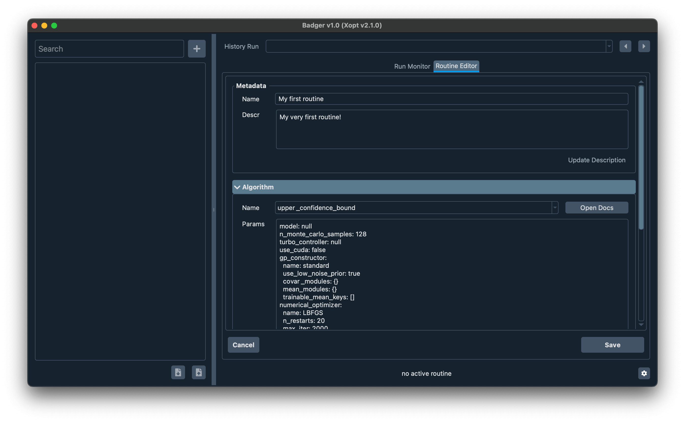
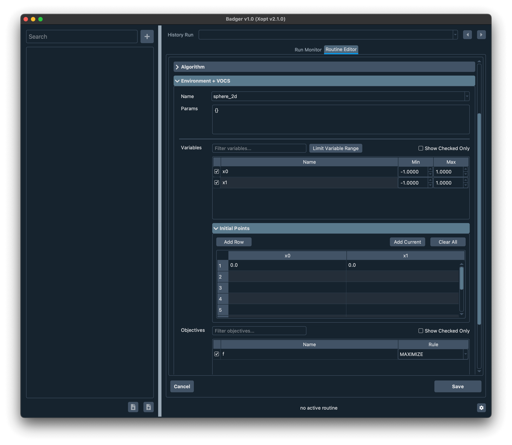
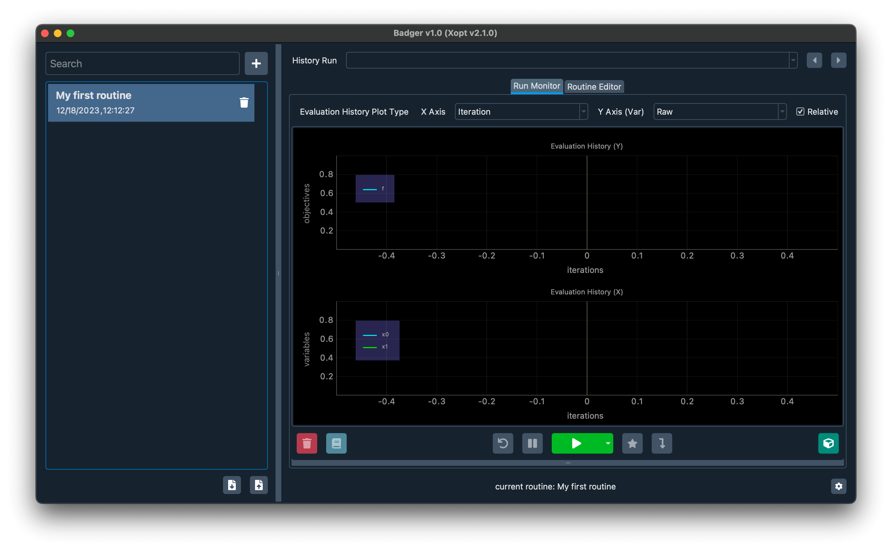
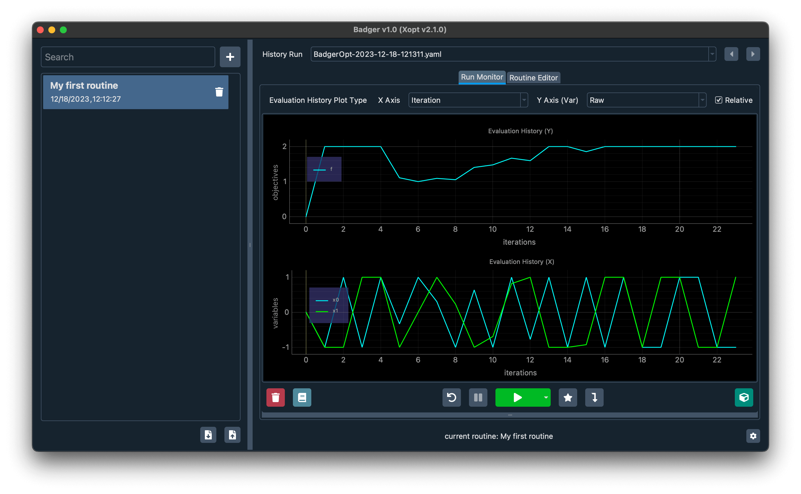
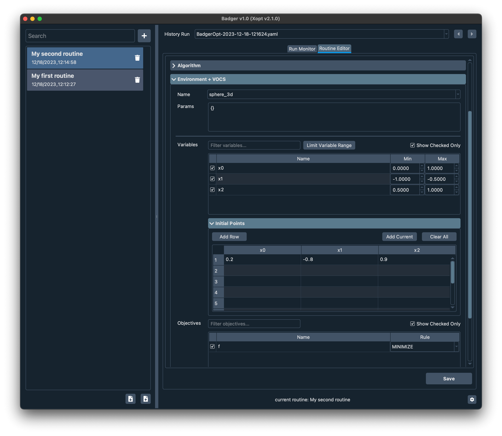

# Tutorial (GUI mode)

:::note Heads-up

Make sure you have Badger [installed and setup](./installation).

:::

In this short tutorial, we are going to launch Badger in GUI mode, create a routine using the default `sphere_2d` environment shipped with Badger that optimize the following toy problem:

$$
\begin{aligned}
& \underset{x_0,\ x_1}{\text{maximize}}
& & x_0^2 + x_1^2 \\
& \text{subject to}
& & x_i \in [-1, 1], \; i = 0, 1.
\end{aligned}
$$

Then we'll customize the `sphere_2d` environment a bit to add one more variable and shape a `sphere_3d` environment, configure Badger so that it saves data to the directories we specify, create our second routine based on the new `sphere_3d` environment and finally run a new optimization on the problem below:

$$
\begin{aligned}
& \underset{x_0,\ x_1,\ x_2}{\text{minimize}}
& & x_0^2 + x_1^2 + x_2^2 \\
& \text{subject to}
& & x_0 \in [0, 1],\ x_1 \in [-1, -0.5],\ x_2 \in [0.5, 1] \;
\end{aligned}
$$

Let's get started.

## Launch the Badger GUI

Run the following command in your terminal to launch the Badger GUI (assume you are in the python environment in which Badger was installed):

```shell
badger -g
```

You should be able to see the main GUI like below:


## Run your first optimization

Before you can run the optimization, you need to create the routine. Click the plus button to the right of the search bar, you'll be navigated to the routine editor:



Where you can change the routine name and description in the **Metadata** section, as shown above. For your first routine, let's select `expected_improvement` generator[^generator] in the **Algorithm** section. In the **Environment + VOCS** section, select the sphere_2d environment that shipped with Badger.

Now we can shape our optimization problem by configuring the VOCS:



To archive the above configuration, simply click the blank cell on top of the checkboxes in the variable table to include all the two variables in the routine, then click the *Add Current* button in the **Initial Points** section to add the current values of the variables as the initial points where the optimization starts from. You of course can add more initial points as you wish but for now let's keep it simple -- we only start the run from the current values. Finally check the `f` observable shown in the objectives table and change the rule (direction of the optimization) to `MAXIMIZE`, this means we'll maximize `f` instead of minimize it (which is the default setting).

Now click the *Save* button and we'll be landing back on the main GUI where you can see the monitors, while you'll notice the routine we just created is up there in the routine list, selected and ready to run!



Now go ahead and click the green *Run* button, feel free to pause/resume the run anytime by clicking the button to the left of the run button, and click the run button (should be turned red now) again to terminate the run.

Congrats! You just run your very first routine in Badger!



## Customize the environment

Now it's time to do some more serious stuff -- such as performing optimization on your own optimization problem. In order to do that, we need to create our own custom environment (and optionally, the corresponding interface).

First let's point Badger to a new folder where we would like to store our custom plugins. In terminal, do:

```shell
badger config BADGER_PLUGIN_ROOT
```

Follow the CLI guide and set your root for the plugins.

Once that done, put a folder named `sphere_3d` into the environments dir under your plugins root.

Then create the following files inside that `sphere_3d` folder:

- The main python script:

```python title="__init__.py"
from badger import environment


class Environment(environment.Environment):

    name = 'sphere_3d'  # name of the environment
    variables = {  # variables and their hard-limited ranges
        'x0': [-1, 1],
        'x1': [-1, 1],
        'x2': [-1, 1],
    }
    observables = ['f']  # measurements

    # Internal variables to store the current values of
    # the variables and observables
    _variables = {
        'x0': 0.0,
        'x1': 0.0,
        'x2': 0.0,
    }
    _observations = {
        'f': None,
    }

    # Variable getter -- tells Badger how to get current values of the variables
    def get_variables(self, variable_names):
        variable_outputs = {v: self._variables[v] for v in variable_names}

        return variable_outputs

    # Variable setter -- how to set variables to the given values
    def set_variables(self, variable_inputs: dict[str, float]):
        for var, x in variable_inputs.items():
            self._variables[var] = x

        # Filling up the observations
        f = self._variables['x0'] ** 2 + self._variables['x1'] ** 2 + \
            self._variables['x2'] ** 2

        self._observations['f'] = [f]

    # Observable getter -- how to get current values of the observables
    def get_observables(self, observable_names):
        return {k: self._observations[k] for k in observable_names}
```

- The config file:

```yaml title="configs.yaml"
---
name: sphere_3d
description: "3D sphere test environment"
version: "0.1"
dependencies:
  - torch
  - badger-opt
```

- And an optional readme:

```markdown title="README.md"
# 3D Sphere Test Environment for Badger

## Prerequisites

## Usage
```

Now relaunch Badger GUI, you should be able the see the new custom environment we just created in the dropdown menu in the environment selector:


## Configure important Badger settings

You can run the following command to see which settings are configurable in Badger:

```shell
badger config
```

For example you'd like to change the dir where all the databases are stored, you can do:

```shell
badger config BADGER_DB_ROOT
```

Badger would guide you through the setting.

## Run your second optimization

Now it's time to create our new routine with the newly created `sphere_3d` environment. This time we don't have to start from the scratch, instead, we'll base on our first routine, modify the parts as needed, and save the changes as a new routine.

We start by selecting the first routine, then click the *routine editor* tab. Edit the name, description, and the VOCS:



Note that we need to select the `sphere_3d` environment from the env selector and change the variable ranges in the new routine according to our target problem. We'll also change the initial point so that the optimization won't start with the best solution. Since our second problem is a minimization one, remember to change the direction of `f` to *MINIMIZE*. Once configuration is done, click *Save* to save it as a new routine, `my second routine`.

Now we can just run it as we do for `my first routine`, stop whenever you feel right, you should see some optimization curves like this:


Congrats! You have accomplished the Badger GUI tutorial! Hope that by this point you already have some feelings about what Badger is and how Badger works. Now you can continue and do the [CLI tutorial](tutorial_1) to get to know the other side of Badger, or you can jump directly to the [guides](../guides/create-a-plugin#create-an-environment-plugin) to adapt Badger to your own optimization problem, good luck!

[^generator]: Term in Xopt, means algorithm
