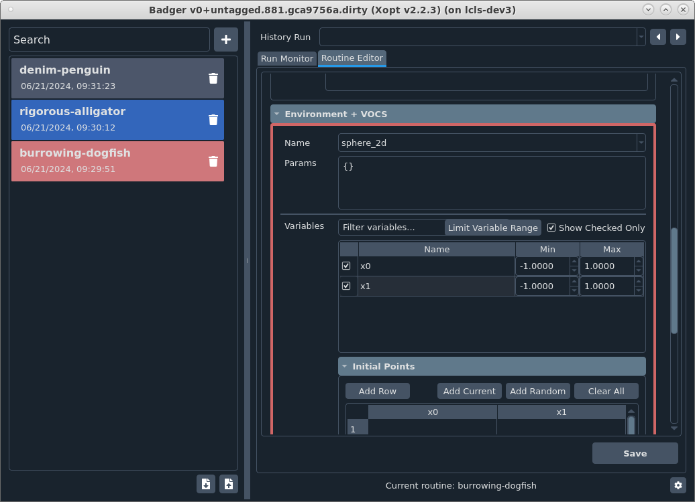

# Color by environment

You can color entries in the routine list and the border of the environment box in the routine editor based on the environment you choose. This is done by identifying colors with environments in a yaml file.

## Creating the yaml file

Assuming you've created your own custom environments (if you haven't, see the **Customize the environment** section of the **Tutorial (GUI mode)**), create a yaml file called `env_colors.yaml` in the same environments directory of the plugin root. For each environment, you will identify a color in hexcode for each of the following states:

- `normal` (non-selected routine, also identifies color for environment box border)
- `normal_hover` (hover over non-selected routine)
- `activate` (selected routine)
- `activate_hover` (hover over selected routine)

If you need help identifying hexcodes for colors, you can use a website like https://htmlcolorcodes.com/. After that, you're done! Next time you open the GUI, you will see the routines and environment box colored based on your yaml file.

## Example

Here is a yaml file that gives a pink color scheme for the `sphere_2d` environment and a blue color scheme for the `sphere_3d` environment.

```yaml title="env_colors.yaml"
---
sphere_2d:
  normal: '#D06666'
  normal_hover: '#E291A8'
  activate: '#CF777B'
  activate_hover: '#D8848C'
sphere_3d:
  normal: '#3366BB'
  normal_hover: '#4591FD'
  activate: '#3277D0'
  activate_hover: '#3B84E1'
```

Here is what the GUI then looks like


