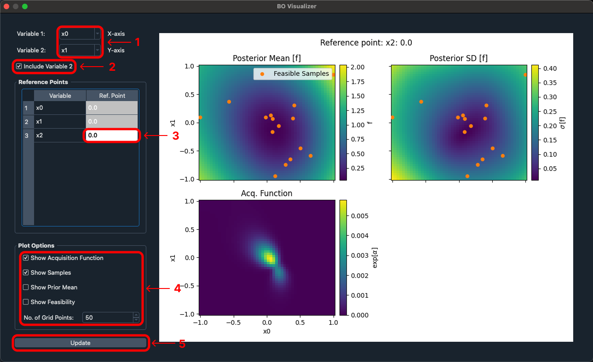

# BO Visualization Extension Documentation

## Overview

The BO Visualization extension allows for an interactive graphical interpretation of the model of the objective and constraining functions generated during BO an optimization.

## Usage

The extension can be used both statically and dynamically during or after a Badger optimization run. When used during an Badger optimization, the plots will update at a set interval in real time according to the variables and plot options set. Any plot options, reference points, and variables are saved throughout the use of that instance of the BO Visualization extension and are lost when the window is closed.

## Constraints

The BO Visualization extension is only available when conducting a Badger optimization that uses a Bayesian Generator such as the `expected_improvement` and `mobo` algorithms.

## Tutorial

### Step 1: Start Badger optimization

First step to use the BO Visualization is to use the Badger UI to run through an optimization using a compatible Bayesian algorithm.

Once you have a converged on a solution or have stopped the optimization after a certain number of iterations, you can visualize the model of the objective and constraint functions by opening the BO Visualization extension.

### Step 2: How to access the extension

Description:

**1** - Access the Badger extensions palette by clicking the icon in the bottom right

**2** - The Badger extensions palette contains all extensions included by default with Badger
    Note: not all extensions are applicable to every optimization configuration

**3** - Access the BO Visualization extension by clicking the corresponding option within the Badger extensions palette

### Step 3: BO Visualization controls

Description:

**1** - Change the variables that are being plotted by the X and Y axes within the extension

**2** - By default the extension will plot two variables with a color map signifying the third axes, If you wish to only plot a single variable at a time you can uncheck this option

**3** - If you wish to change the reference point that is being plotted against then you can input in the desired number and the plots will update accordingly

- **Note:** In >2D spaces the reference point will display the input space value for axes that are not visualized on the plot

**4** - If you wish to change what is information being displayed you can do so by modifying the various plot options

- **Acquisition function** - value is maximized to select the next point to observe during Bayesian optimization.
  - **Note:** acquisition function is often exponentiated for visualization purposes.

- **Samples (Optional)** - location of data points used to train the model, projected onto the 1D or 2D axes.
  - **Note:** Data points that satisfy the constraints are shown as filled orange circles (Feasible samples) and data that does not satisfy the constraints are shown as unfilled red circles

- **Prior Mean (Optional)** -

- **Feasibility (Optional)** - the probability that all of the constraints are satisfied at a given location

- **No. of grid points** - the number of mesh points used to visualize the model value, higher number of points produces a higher resolution visualization, but at the cost of increased computation time

**5** - The BO Visualization extension will automatically update the charts reactively upon any changes however, if at any point you believe the plots are out of sync then you can forcefully update the plots using the update button

### Charts explanation

Shown in each of the examples is the predicted mean and uncertainty of each objective and constraint. The display of information is dependent on if plotting only a single variable or two at a time.

- In 1D the mean is shown by the solid line, while the 2 sigma confidence region on either side is shown as shaded regions

- In 2D, the mean and variance are shown in separate plots (shown in step 3)

#### One dimensional chart

