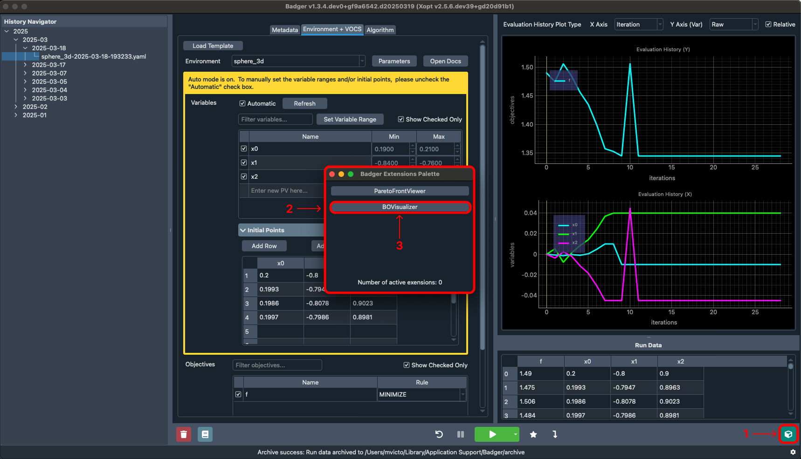
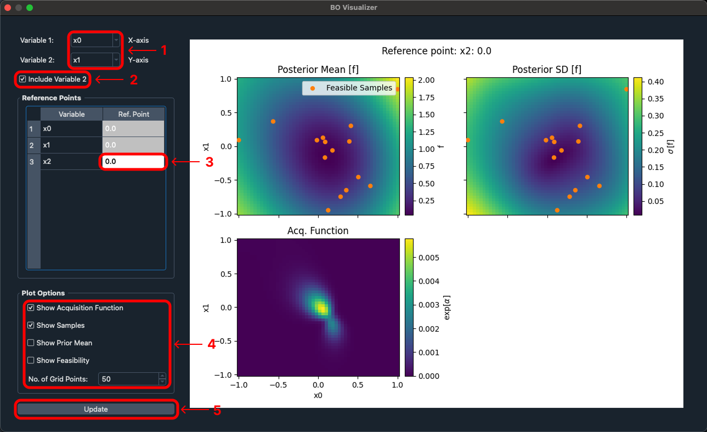
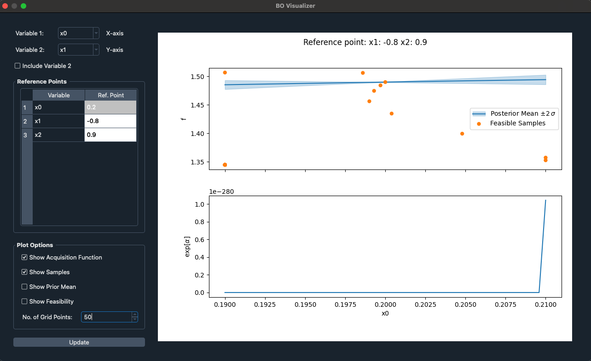

# BO Visualization extension Documentation

## Overview

The BO Visualization extension allows for an interactive graphical interpretation of the results from a Badger optimization.

## Usage

The extension can be used both statically and dynamically during or after a Badger optimization run. When used during an Badger optimization, the plots will update at a set interval in real time according to the variables and plot options set. Any plot options, reference points, and variables are saved throughout the use of that instance of the BO Visualization extension and are lost when the window is closed.

## Constraints

The BO Visualization extension is only available when conducting a Badger optimization that uses a Bayesian Generator.

## Tutorial

First step to use the BO Visualization is to use the Badger UI to run through an optimization using a compatible Bayesian algorithm.

Once you have a converged on a solution or have stopped the optimization after a certain number of iterations, you can visualize the solution by opening the BO Visualization extension.

Description:

1 - Access the Badger extensions palette by clicking the icon in the bottom right
2 - The Badger extensions palette contains all extensions included by default with Badger
    Note: not all extensions are applicable to every optimization configuration
3 - Access the BO Visualization extension by clicking the corresponding option within the Badger extensions palette

Description:

1 - Change the variables that are being plotted by the X and Y axes within the extension
2 - By default the extension will plot two variables with a color map signifying the third axes, If you wish to only plot a single variable at a time you can uncheck this option
3 - If you wish to change the reference point that is being plotted against then you can input in the desired number and the plots will update accordingly
4 - If you wish to change what is information being displayed you can do so by modifying the various plot options
5 - The BO Visualization extension will automatically update the charts reactively upon any changes however, if at any point you believe the plots are out of sync then you can forcefully update the plots using the update button

Once you get comfortable with using the extension, having the extension open will reactively update upon future optimization work and when switching between previous optimization runs.
